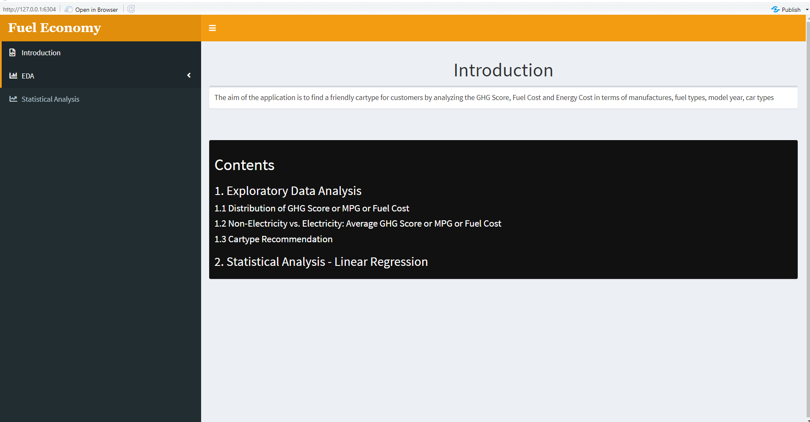

```{r, include = FALSE}
knitr::opts_chunk$set(
  collapse = TRUE,
  comment = "#>"
)
```


### Use case

a) The aim of the application is to find a friendly car type for "customers" by analyzing the GHG Score, Fuel Cost and Energy Cost in terms of manufactures, fuel types, model year, and car types.

b) The application is designed for people who have the interest to buy a car. 

### Required Packages

a) For running this app, we need our users to run the the following packages:
   * shiny - For app
   * shinydashboard - customize UI
   * shinyWidgets - setting screen
   * shinythemes - themes
   * DT - For data table
   * plotly - For plot
   * tidyverse - For tidy
   * reactlog - Reactive Visualizer
   * lazyeval - For plot

### Data Source and Structure

a) Data source
   * www.fueleconomy.gov
   .png){#id .class width=100% height=100%}
   * There are 43098 rows and 83 columns. The data shows lots of information about the vehicle such as model, make, fuel type, as a categorical variable and city08, ghgscore, fuelCost08 as quantitative variable. In fueltype, the data separate into 16 variables. The unknow value inside the data is displayed as NA.
   

### EDA Inputs, Controls, and Outputs

a) We can choose different tab on the left as the screenshot shows.
{#id .class width=100% height=100%}

b) The first tab of Distribution of GHG Score/MPG/Cost
.png){#id .class width=100% height=100%}
   * Users can choose the fuel type and the car manufacture by their own will.
   * Users can choose GHG(Green house gas), MPG(Miles per gallon), and annual fuel cost to analyze what car they have interest.
   * We also add a plot on the right for users.
   
c) The second one is Average GHG/MPG/Energy Consumption
.png){#id .class width=100% height=100%}
   * Users can choose different road types to compare different fuel type.
   * Users can select the year range on the left. 
   * We found that except the electricity, the other fuel type can go further on the highway. For electricity car on the highway, it costs more power than in the city. 
   
d) Based on the analyze of above. The last one is for users to choose any car they would like to buy. 
.png){#id .class width=100% height=100%}
   * The first two select inputs and choose the fuel type of car, by choosing different fuel type user can compare different fuel type car by showing the difference of MPG(miles per gallon) for each car. 
   * The check box for green house score that user can know how clean those picked car is. Sometime there has a duplicated in car-type so transmission check box can help the use know the difference easily. By clicking the fuel cost button user can also know about the cost of the car while showing the MPG.
   * Users can use the slide bar to choose how many cars they would like to see and compared.


### Statistical Analysis Inputs, Controls, and Outputs

a) Statistical Analysis part
.png){#id .class width=100% height=100%}
   * We decide to fine out the how cylinders and displ affect other factor which is the a component of car. Also the user can type an x value to predict the y value. Log check box added.
   * User can select cylinders or displ for x axis and co2, fuel cost, city08, ghgscore for y axis and type a number to predict y value base on x value and also there is an summary to explain the plot user got.
   *The output will show a distribution base on the select value and also a line to show the linear relation between two values. Also there is a summary and prediction on it. user can see the the log plot after clicking the check box
### References

1) https://gasprices.aaa.com/state-gas-price-averages/

2) https://www.epa.gov/greenvehicles/greenhouse-gas-rating

3) https://www.fueleconomy.gov/feg/ws/#fuelType1

